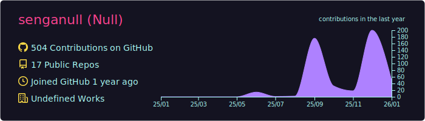
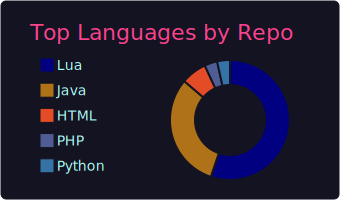
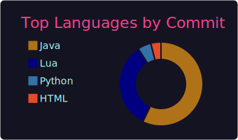
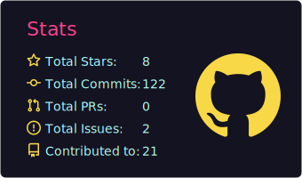

  

---

  

 

  
  
  

---

### 自己紹介

- 現在、Minecraft経済サーバーおよびFiveM用スクリプトの開発に取り組んでいます。
- Java、PHP、Webアプリケーション開発を学習中です。
- 目標: 同時接続100人規模サーバー主になること
- 興味: サーバー管理タスクの自動化

---

### 技術スタック

**▼ 使用言語 (自動取得)**

  

**▼ 開発ツール・プラットフォーム**

  
  
  
  

---

### 活動実績トロフィー

  

